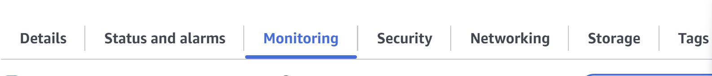

# Dashboard

1. Log onto AWS.

2. Enter your username and password.

3. Create an instance (this process is shown in another file).

4. Once your instance is created, go to your Instance Summary page and click on Monitoring (if it is not already highlighted in blue).

"This is what you need to look for"

5. After doing this, you should see a number of different charts. These show the metrics that we will later add to the dashboard.

6. On the right-hand side, you will see a button called "Manage detailed monitoring". Click this button.

7. A window will appear showing your instance. Once the change is applied, the window will disappear.

8. Next, you will see three dots next to Explore related. Click these three dots.

9. A menu will appear with the option "Add to dashboard". Click this option.

   This will open a new window.

10. A window called "Add to dashboard" will appear. This is where we will create a dashboard.  
    If you already have a dashboard, you can search for it, but for the sake of this guide we will create a new one.

 

11. Click "Create new".

12. Enter a dashboard name, for example: `Jonathan-Dashbaord".

   "This is the create dashbaord screen "
   

13. Click Create first (this step is important).

14. Then click the orange "Add to dashboard" button.  
    If you press Add to dashboard before clicking Create, your dashboard will not be created.

    WARNING !

    This will work if you got apps, dtabases or other delpys created for this to work 